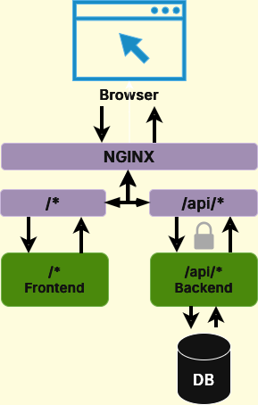
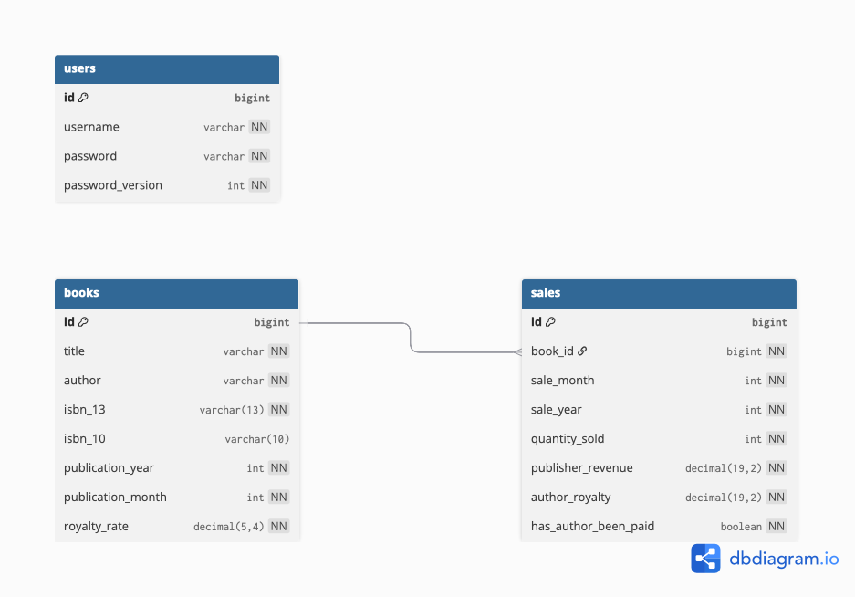

# Developer Guide

## Architecture Overview

The system is a full-stack web application for tracking book sales and author royalty payments.

<p align="center">
  
</p>

The backend is a stateless REST API. Authentication uses JWT tokens stored in HTTP-only cookies; there are no server-side sessions. The frontend is a single-page React app that talks to the backend through the generated API client.

## Tech Stack

| Layer      | Technology                                      |
|------------|--------------------------------------------------|
| Frontend   | React 19, TypeScript 5.9, MUI v7, Vite 7        |
| Backend    | Java 21, Spring Boot 3.2.1, Gradle               |
| Database   | PostgreSQL 16                                     |
| Auth       | JWT (via Auth0 java-jwt), HTTP-only cookies       |
| API Client | Auto-generated from OpenAPI spec                  |
| Infra      | Docker Compose, Nginx                             |
| CI         | GitHub Actions                                    |

## Project Structure

```
.
├── backend/
│   └── src/main/java/edu/duke/bookpublishing/
│       ├── auth/           # Users, JWT, login/logout, security filter
│       ├── books/          # Book CRUD, ISBN validation, OpenLibrary lookup
│       │   └── lookup/     # OpenLibrary API client
│       ├── sales/          # Sales CRUD, royalty calculation, author payments
│       ├── config/         # Spring Security config
│       ├── exception/      # Global exception handler
│       └── common/         # Shared DTOs (PagedResponse)
├── frontend/
│   └── src/
│       ├── api/generated/  # Auto-generated TypeScript API client
│       ├── pages/
│       │   ├── auth/       # Login page
│       │   └── dashboard/
│       │       └── crud-dashboard/
│       │           ├── components/  # All UI components (BookList, SaleList, etc.)
│       │           ├── data/        # API data accessors
│       │           ├── hooks/       # useNotifications, useDialogs
│       │           └── context/     # Sidebar state
│       ├── context/        # AuthContext, ColorSchemeContext
│       └── theme/          # MUI theme configuration
├── deployment/             # Nginx configs (dev + prod)
├── docker-compose.yml
├── justfile                # Task runner commands
└── .github/workflows/      # CI pipeline
```

## Dev Environment Setup

### Prerequisites

- Java 21 (Temurin recommended)
- Node.js 22 (see `.nvmrc`)
- Docker and Docker Compose
- [just](https://github.com/casey/just) command runner (optional but recommended)

### Environment Variables

Copy `.env.example` to `.env` and fill in values:

```bash
cp .env.example .env
```

| Variable               | Description                          | Default / Example             |
|------------------------|--------------------------------------|-------------------------------|
| `DB_USERNAME`          | PostgreSQL username                  | `bookpub_user`                |
| `DB_PASSWORD`          | PostgreSQL password                  | (set a secure password)       |
| `JWT_SECRET`           | HMAC256 signing key for JWT tokens   | (set a secure random string)  |
| `JWT_EXPIRATION_HOURS` | Token lifetime                       | `24`                          |
| `ADMIN_PASSWORD`       | Default admin account password       | `admin`                       |

All variables are consumed by `docker-compose.yml` and passed to the backend as Spring environment overrides.

### Running with Docker Compose (recommended)

```bash
docker compose --profile dev up --build
```

This starts all services: PostgreSQL, backend, frontend (Vite dev server with HMR), and Nginx. The app is available at `http://localhost`.

### Running without Docker

If you prefer to run services individually:

1. **Database**: Start a PostgreSQL 16 instance with a `book_publishing` database.

2. **Backend**:
   ```bash
   cd backend
   ./gradlew bootRun
   ```
   Runs on `http://localhost:8080`. Configure DB connection via environment variables or edit `application-dev.properties`.

3. **Frontend**:
   ```bash
   cd frontend
   npm install
   npm run dev
   ```
   Runs on `http://localhost:5173`. API requests are proxied to `localhost:8080` via Vite's dev proxy.

### Useful Commands

All available via `just <command>`:

| Command          | What it does                                   |
|------------------|------------------------------------------------|
| `just api`       | Regenerate the TypeScript API client from OpenAPI spec* |
| `just test`      | Run backend + frontend tests                   |
| `just test-backend`  | Run backend tests only                     |
| `just test-frontend` | Run frontend tests only                    |
| `just lint`      | Check formatting (Spotless) and lint (ESLint)  |
| `just format`    | Auto-fix formatting for both backend and frontend |
| `just check`     | Run everything: api gen, format, lint, test*    |

\* `just api` and `just check` fetch the OpenAPI spec from the running backend. **The backend must be running and accessible at `localhost:8080`** before you run these commands, or they will fail.

### Swagger UI

Available in dev at `http://localhost:8080/swagger-ui.html` (or through Nginx at `http://localhost/swagger-ui.html`). Disabled in production.

## Database Schema

<p align="center">
  
</p>

**Relationships:**
- `sales.book_id` -> `books.id` (many-to-one, cascade delete)
- `users` is standalone (no foreign keys)

The schema is managed by Hibernate with `ddl-auto=update`. There are no migration files. Hibernate creates and modifies tables automatically based on the JPA entity definitions.

## API and Code Generation

The backend exposes an OpenAPI spec at `/api-docs`. The frontend TypeScript client (`frontend/src/api/generated/`) is auto-generated from this spec using `openapi-typescript-codegen`.

**When you change a backend endpoint or DTO**, regenerate the client:

```bash
just api
```

CI will fail if the generated client is out of date. The `check-api-schema` job starts the backend, regenerates the client, and checks for a diff.

## CI / Code Quality

GitHub Actions runs on every push and PR (`.github/workflows/check.yml`). Three parallel jobs:

| Job                  | Checks                                                  |
|----------------------|----------------------------------------------------------|
| `check-api-schema`   | Generated API client matches current backend spec       |
| `check-frontend`     | Prettier format, ESLint lint, Vitest tests              |
| `check-backend`      | Spotless format (Google Java Format), JUnit tests       |

Run the full CI suite locally before pushing:

```bash
just check
```
